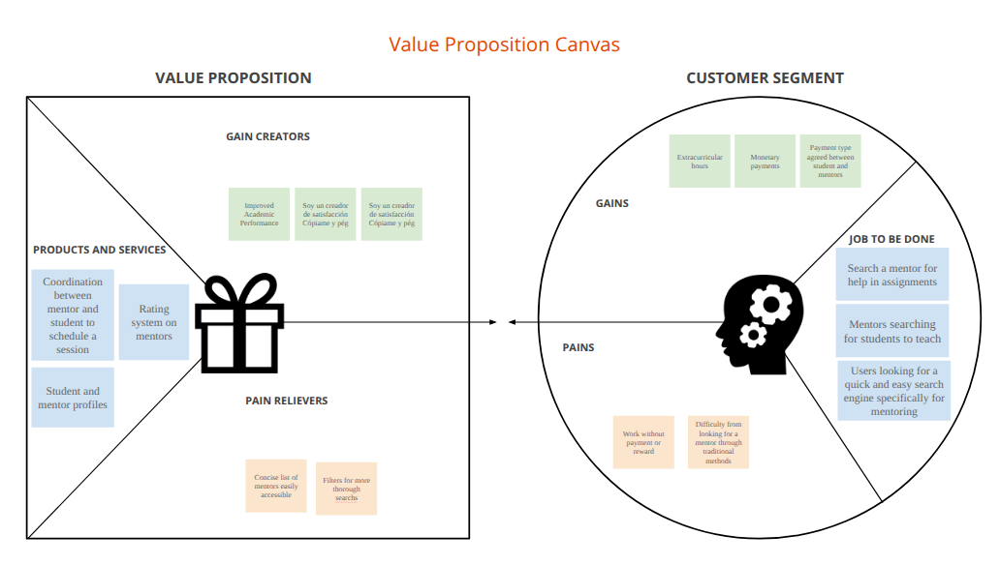
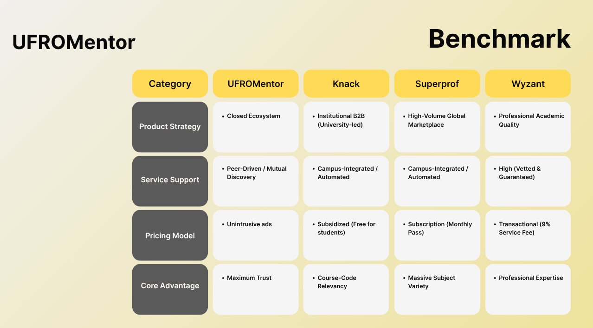
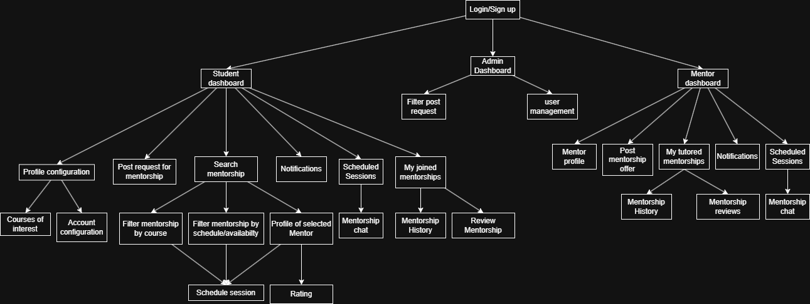

# UFROMentor

> A quick and easy search engine for mentoring — connecting students who need help with peers who can teach it.

**Course:** Diseño de Experiencia de Usuario e Interacción Humano Computador — UXD-HCI 202
**Department:** Departamento de Cs. Computación e Informática
**University:** Universidad de La Frontera (UFRO), Temuco, Chile

---

## Index
1. [Introduction](#1-introduction)
2. [Team & Roles](#2-team--roles)
3. [Strategy](#3-strategy)
4. [Scope](#4-scope)
5. [Structure](#5-structure)
6. [Skeleton](#6-skeleton)
7. [Surface](#7-surface)
8. [Annex](#8-annex)

---

## 1. Introduction

### 1.1. The Problem
> *"I put up posters at the university offering classes, but they rarely work to attract attention."*

University students who fall behind in their courses struggle to find reliable, accessible help, while students who are strong in a subject have no easy way to offer their knowledge. Research surfaced pain points such as:
- No centralized, university-focused place to search for a mentor or tutor — students resort to informal channels like posters or word of mouth.
- Difficulty coordinating schedules and availability between mentor and mentee.
- No trust/rating system to know if a mentor is actually qualified before booking a session.

### 1.2. Our Solution
UFROMentor is a mobile-first platform that connects students who need academic support with peers who can mentor them, centered on a search-and-schedule experience built specifically for university course codes.

- **Mentor/Tutor Features:** Create a mentor profile, list available courses, set availability, receive and manage mentorship requests, chat with mentees, and build a rating history.
- **Student/Mentee Features:** Search and filter mentors by course and availability, request and schedule mentorship sessions, chat with the mentor, track session history, and leave reviews.

---

## 2. Team & Roles

| Name | Role |

| Maximiliano Rivas Cuevas | Development Lead |

# Honorable mentions
-| Lorenzo López | Ex-Development Lead |
-| Bastian Wenckhans | Ex - Finance Leader |

---

## 3. Strategy

### 3.1. Value Proposition Canvas
The Value Proposition Canvas was used to map the mentee's jobs-to-be-done (searching for a mentor, coordinating help with assignments, scheduling sessions) against pains (unreliable/informal search methods) and gains (a fast, purpose-built mentoring search engine with a rating system). On the mentor side, the canvas maps the job of finding students to teach.



### 3.2. UX Personas
Three personas were derived from user research, representing both sides of the platform (mentee and mentor):

**Persona 1 — Fernanda Cid**
> *"Hello, I'm Fernanda Cid, a Computer Engineering student. I want to finish my studies as soon as possible to help my family, and to travel during vacations while still studying and learning."*
- **Demographics:** 24 years old, Female, Computer Engineering student, Labranza, in a relationship.
- **Key need:** Find tutoring help to catch up on subjects she's falling behind in, since she can't find in-person tutors.
- **Main frustration:** Fear of not progressing and becoming stuck in her professional career, and not having time to enjoy free time or travel.
- `![Persona 1].(assets/UX Persona/UX Persona1.png)`

**Persona 2 — Mateo Valenzuela**
- **Demographics:** 20 years old, Male, Civil Mathematical Engineering student, Villarrica, single. Introverted, analytical, results-driven, stressed under pressure. Interests: music, streaming, playing guitar, traveling.
- **Key need:** Availability from Tuesday to Friday, a private study environment, and the ability to study in a small group of 3 people.
- **Main frustration:** It's difficult to find a good tutor, and difficult to study alone.
- `![Persona 2].(assets/UX Persona/UX Persona2.png)`

**Persona 3 — [Persona Name]**
> *"I put up posters at the university offering classes, but they rarely work to attract attention."*
- **Demographics:** 22 years old, Temuco, Civil Computer Engineering.
- **Key need:** View mentoring requests according to his availability, and a direct communication channel within the platform.
- **Main frustration:** Traditional promotion methods (posters, word of mouth) don't attract mentees.
- ``

### 3.3. Benchmark Analysis
A competitive benchmark compared UFROMentor against three tutoring/mentoring platforms: **Knack**, **Superprof**, and **Wyzant**.

1. **Tool Selection & Justification**

| # | Tool | Category |

| 1 | Knack | Institutional B2B (University-led) |
| 2 | Superprof | High-Volume Global Marketplace |
| 3 | Wyzant | Professional Academic Quality |

**Benchmark summary (extracted from the comparison matrix):**

| Category | UFROMentor | Knack | Superprof | Wyzant |

| Product Strategy | [Define UFROMentor's strategy] | Closed Ecosystem / Institutional B2B (University-led) | High-Volume Global Marketplace | Professional Academic Quality |
| Service | [Define UFROMentor's service model] | Peer-Driven / Mutual Support | Campus-Integrated / Automated Discovery | High (Vetted & Guaranteed) |
| Pricing Model | [Define UFROMentor's pricing] | Unintrusive ads / Subsidized (free for students) | Subscription (Monthly Pass) | Transactional (9% Service Fee) |
| Core Advantage | [Define UFROMentor's differentiator] | Maximum Trust / Course-Code Relevancy | Massive Subject Variety | Professional Expertise |

**Key differentiator:** [Summarize what sets UFROMentor apart — e.g. a course-code-relevant, trust-driven mentoring search built specifically for one university's student body.]



---

## 4. Scope

### 4.1. Functional Requirements

| # | Functionality | Target Persona | Source |
|---|---|---|---|
| 1 | Search and filter mentors by course | Persona 1 | Value Proposition Canvas |
| 2 | Schedule a mentorship session | Persona 2 | Value Proposition Canvas |
| 3 | Rate and review a mentor after a session | Persona 1 | Benchmark gap (Trust) |
| 4 | View mentoring requests filtered by availability | Persona 3 | User research |
| 5 | In-app chat between mentor and mentee | Persona 3 | User research |

### 4.2. Restrictions & Exclusions

| Excluded Feature | Reason | Competitor that has it |
|---|---|---|
| Paid/transactional service fees | Keep the platform peer-driven and free for students | Wyzant |
| Global, cross-university marketplace | Focus scope on a single university's course catalog | Superprof |

### 4.3. Navigation Patterns Adopted from Benchmark

| Pattern | Adopted from | Decision |
|---|---|---|
| Course-code-based mentor search | Knack | Accepted — matches student mental model of searching by course |
| Subject/category browsing | Superprof | Accepted, For time i couldn't implement it |

---

## 5. Structure

### 5.1. Navigation Flow

```
Login / Sign Up
└── Dashboard (role-based)
    ├── Student Dashboard
    │   ├── Search Mentors
    │   │   └── Filter by Course / Availability
    │   ├── Mentorship Requests
    │   │   ├── Scheduled Sessions
    │   │   └── Joined Mentorships
    │   ├── Mentor Profile View
    │   │   └── Mentorship Chat
    │   ├── Mentorship History
    │   │   └── Review Mentorship
    │   ├── Notifications
    │   └── Account / Profile Configuration
    └── Mentor Dashboard
        ├── Post Management
        │   └── Post My Tutored Courses
        ├── Mentorship Requests
        │   └── Scheduled Sessions
        ├── Mentorship Chat
        ├── Mentorship History
        ├── Notifications
        └── Account / Profile Configuration
```



---

## 6. Skeleton

### 6.1. Low-Fi Wireframes

| Flow | Screens covered |
|---|---|
| Onboarding & Auth | [e.g. Splash, Login, Sign Up] |
| Search & Discovery | [e.g. Search, Filters, Mentor Profile] |
| Scheduling | [e.g. Availability, Booking Confirmation] |
| Mentorship Management | [e.g. Requests, Chat, History, Review] |

Six low-fidelity iterations are included in `assets/Lo - Fi/`.
Low-Fi Wireframes PDF: `[Add link to Low-Fi Wireframes PDF]`

---

## 7. Surface

### 7.1. Interface Evolution (UX Refactoring)

| Screen | Feedback Received | Correction Applied |
|---|---|---|
| Search screen | Search was not intuitive; no filter to narrow results | It could not be implemented due to time constraints. |
| Mentor-Home navbar | Bottom navbar was inconsistent with other screens (missing search icon) | Implemented |
| Profile | No "Edit Profile" screen existed | It could not be implemented due to time constraints. |
| Profile | Redundant notification buttons on the profile screen | Removed |
| General flow | No screen had a back button except Home in the navbar | We implemented it on certain screens. |
| Payment | Payment history button existed with no associated payment screen | Removed|
| Sign up | No "log in with existing account" option on the registration screen | Implemented |
| Background colors | Two screens used `#ffffff` instead of the standard `#f9f9f9` | Fixed |

### 7.2. Heuristic Evaluation
A heuristic evaluation of the high-fidelity prototype was conducted against Nielsen's 10 usability heuristics by an external review group (Rayen Ancamilla, Eduardo Gomez, and Raul Manriquez), surfacing issues such as missing navigation flow, an unfilterable search screen, and inconsistent navbar/background styling across screens (see table above for the consolidated list).

Heuristic Evaluation PDF: `docs/Evaluación Heurística.pdf`

### 7.3. Accessibility (a11y)

Reference accessibility case study at `docs/Accesibilidad Digital en MercadoLibre.pdf`.

### 7.4. High Definition Interfaces
- Interactive prototype: `https://www.figma.com/proto/PEbr92N7ZGHOrvoeQMHMn5/UfroMentor?node-id=531-1172&t=cksQyuRoescKOnaO-1`

## 8. Annex

**Strategy Deliverables**

| Deliverable | File Link | Description |
|---|---|---|
| Value Proposition Canvas | `assets/canvas_valor.png` | Maps mentee/mentor jobs, pains, and gains |
| UX Personas | `assets/UX Persona/` | Three personas representing mentees and mentors |
| Benchmark Map | `assets/benchmark_capturas.png` | Comparison of UFROMentor vs. Knack, Superprof, and Wyzant |

**Structure Deliverables**

| Customer Journey / Navigation Flow | `assets/customer_journey.png` | Screen-to-screen flow for student and mentor roles |

**Skeleton Deliverables**

| Low-Fi Wireframes | `assets/Lo - Fi/` | Six low-fidelity wireframe iterations |

**Surface Deliverables**

| Heuristic Evaluation | `docs/Evaluación Heurística.pdf` | External evaluation against Nielsen's 10 heuristics |
| Accessibility Reference | `docs/Accesibilidad Digital en MercadoLibre.pdf` | Accessibility case study used as design reference |
| High-Fidelity Prototype | [Add Figma/Adobe XD link] | Final visual design and interactive prototype |

---
> **UXD-HCI 202 · Departamento de Cs. Computación e Informática · Universidad de La Frontera (UFRO), Temuco, Chile**
